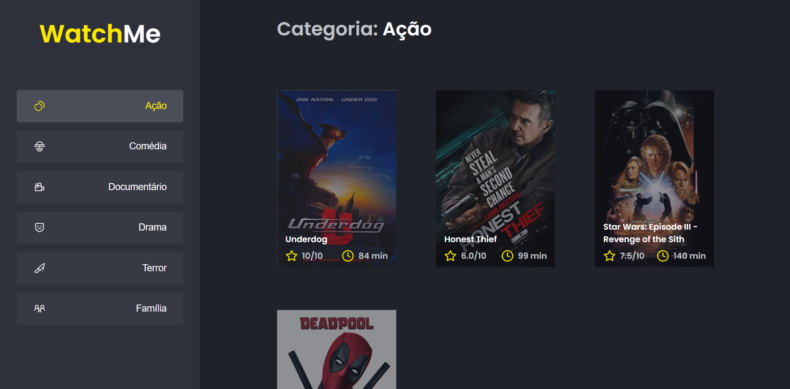

  

# 📖 About

**WatchMe** is a web application, created to be a film catalog.

This project is part of a series of optional challenges on [Rocketseat's](https://www.rocketseat.com.br/) Ignite course, React trail.

# 🔩 Technologies

- [React](https://react.dev/)
- [TypeScript](https://www.typescriptlang.org/)
- [Babel](https://babeljs.io/)
- [Webpack](https://webpack.js.org/)
- [Axios](https://axios-http.com/)
- [JSON Server](https://github.com/typicode/json-server)
